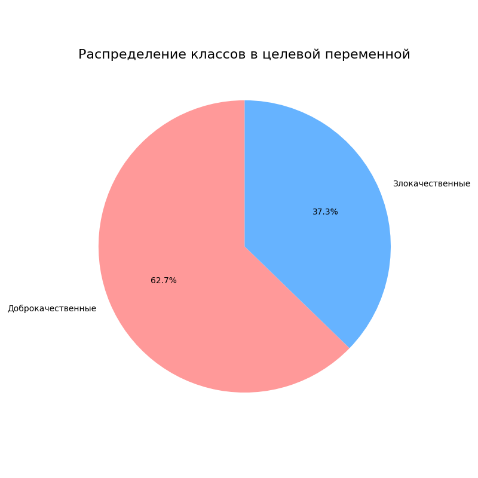
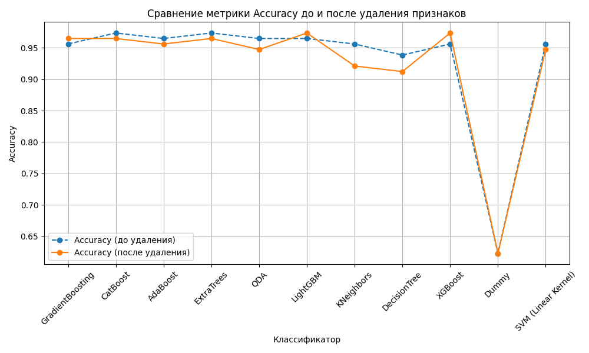
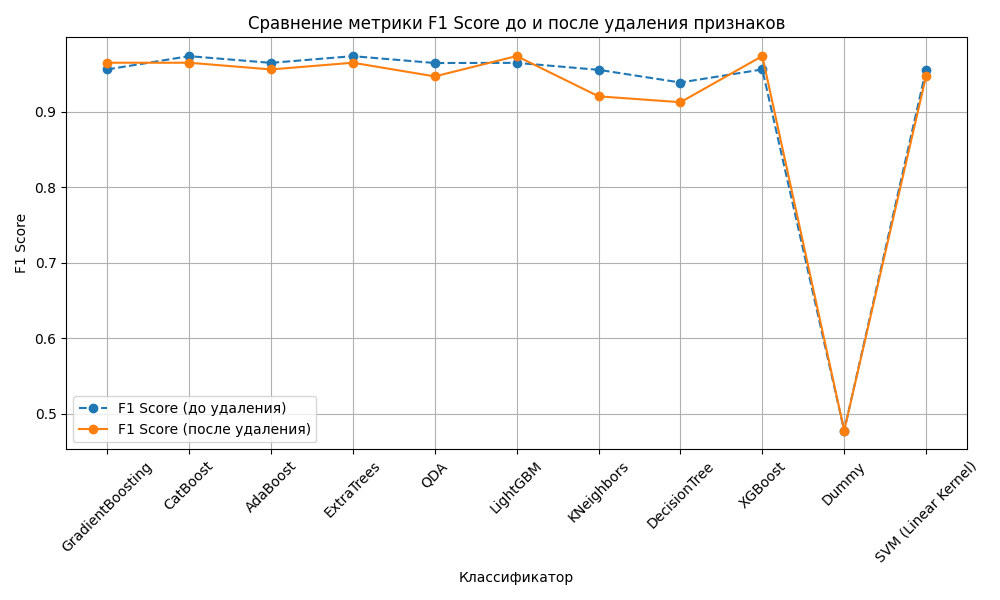
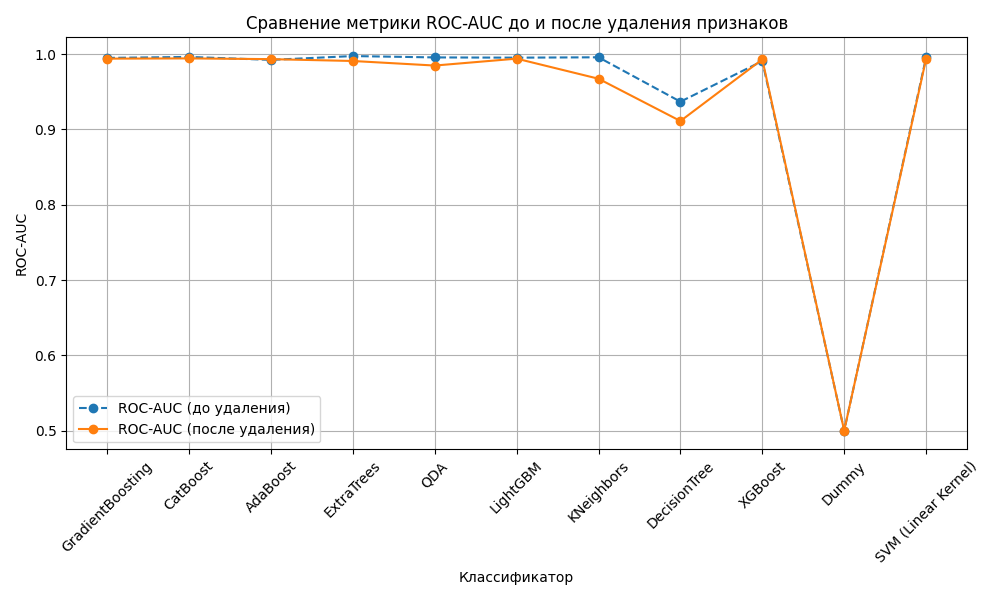
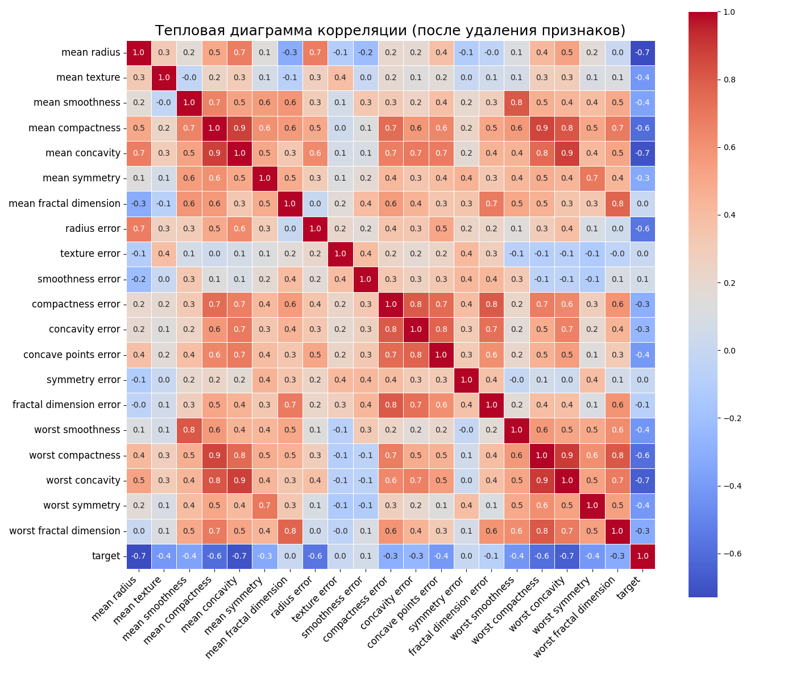
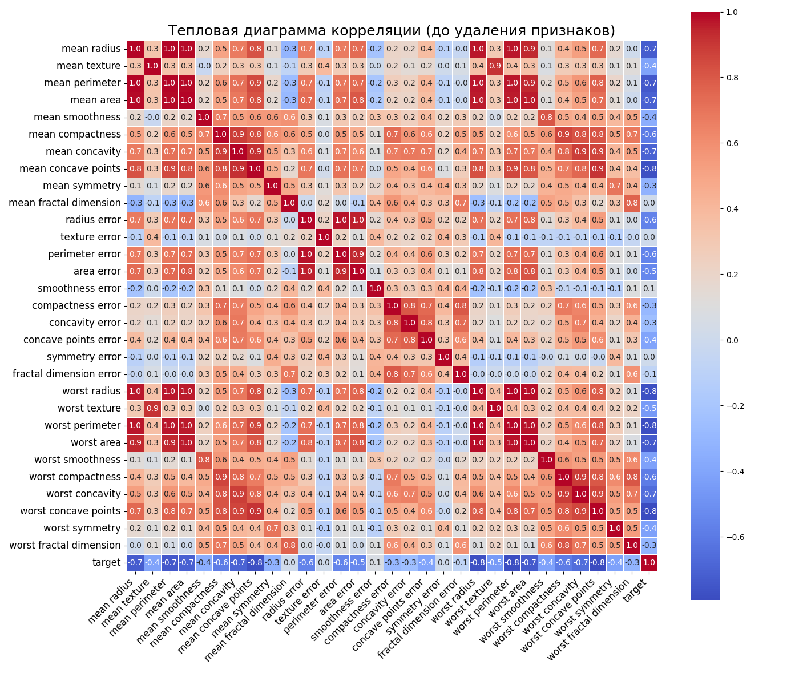
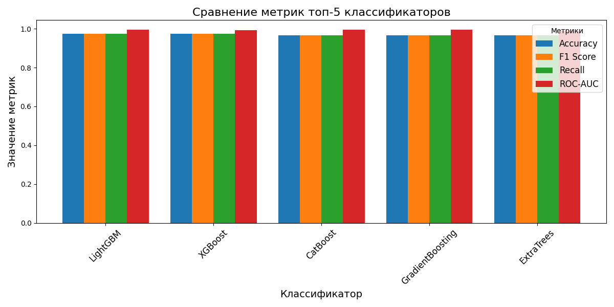

##### Домашняя работа №4
Реализовать минимум 5 классификаторов, сравнить метрики между собой, выбрать лучший для Вашего
датасета.
Классификаторы:

✓ Классификатор градиентного бустинга.

✓ Классификатор CatBoost.

✓ Классификатор Ada Boost.

✓ Классификатор Extra Trees.

✓ Квадратичный дискриминантный анализ.

✓ Light Gradient Boosting Machine.

✓ Классификатор K Neighbors.

✓ Классификатор дерева решений.

✓ Экстремальный градиентный бустинг.

✓ Фиктивный классификатор.

✓ SVM - линейное ядро.

##### Для классификации использовался датасет load_breast_cancer из библиотеки sklearn.

##### Структура проекта

hw4/

├── classification.py # Модуль для сравнения классификаторов

├── data_analysis.py # Модуль для логгирования

├── data_loader.py # Модуль для загрузки данных

├── my_logging.py # Модуль для логгирования

├── save.py # Модуль для сохранения

├── visualization.py # Модуль для визуализации

├── README.md # Документация

├── requirements.txt # Зависимости

├── output_data/ # Папка с выходными данными

└── hw4.ipynb # Реализация в юпитер ноутбуке

##### Графики

