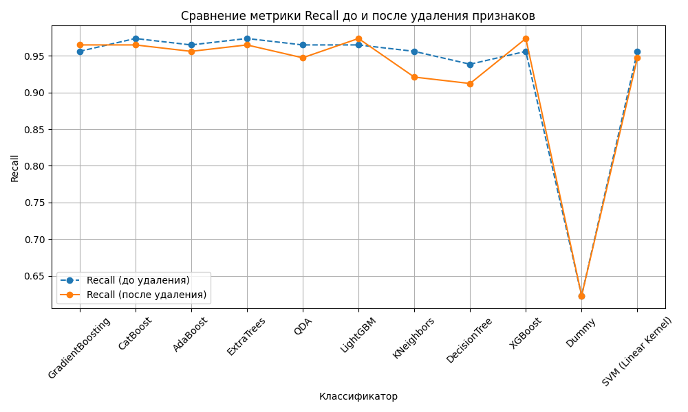

##### Домашняя работа №4
Реализовать минимум 5 классификаторов, сравнить метрики между собой, выбрать лучший для Вашего
датасета.
Классификаторы:

✓ Классификатор градиентного бустинга.

✓ Классификатор CatBoost.

✓ Классификатор Ada Boost.

✓ Классификатор Extra Trees.

✓ Квадратичный дискриминантный анализ.

✓ Light Gradient Boosting Machine.

✓ Классификатор K Neighbors.

✓ Классификатор дерева решений.

✓ Экстремальный градиентный бустинг.

✓ Фиктивный классификатор.

✓ SVM - линейное ядро.

##### Для классификации использовался датасет load_breast_cancer из библиотеки sklearn.

##### Структура проекта

hw4/

├── classification.py # Модуль для сравнения классификаторов

├── data_analysis.py # Модуль для логгирования

├── data_loader.py # Модуль для загрузки данных

├── my_logging.py # Модуль для логгирования

├── save.py # Модуль для сохранения

├── visualization.py # Модуль для визуализации

├── README.md # Документация

├── requirements.txt # Зависимости

├── output_data/ # Папка с выходными данными

└── hw4.ipynb # Реализация в юпитер ноутбуке

##### Графики

##### Краткое описание по шагам задания

Загрузка данных:
Использован датасет Breast Cancer из sklearn, состоящий из признаков для диагностики рака груди.
Признаки сохранены в X, целевая переменная (0 — злокачественная опухоль, 1 — доброкачественная) — в y.

Анализ данных:
Проведён анализ структуры данных, проверка пропущенных значений.
Проверена сбалансированность классов (распределение целевой переменной).

Удаление сильно коррелирующих признаков:
Построена корреляционная матрица.
Убраны признаки с высокой корреляцией (например, > 0.9), чтобы избежать избыточности данных и мультиколлинеарности.

Разделение данных:
Данные разделены на обучающие и тестовые выборки:
До удаления коррелирующих признаков.
После удаления коррелирующих признаков.

Сравнение моделей:
Проведена оценка производительности заданных классификаторов.
Использованы метрики: Accuracy, F1 Score, Recall, ROC-AUC.
Результаты сохранены в файлы classification_results_before.csv и classification_results_after.csv.

Выбор топ-5 моделей:
Для результатов после удаления коррелирующих признаков рассчитан средний балл (Mean Score) по всем метрикам.
Топ-5 моделей выбраны на основе Mean Score.
Построен график метрик для этих моделей.

##### Почему в топ-5 вошли именно эти классификаторы?

Высокие значения метрик:
Топ-5 классификаторов демонстрируют consistently высокие значения по всем ключевым метрикам (Accuracy, F1 Score, Recall, ROC-AUC).
Они лучше всего справляются с задачей классификации как на сбалансированных, так и несбалансированных данных.

Универсальность:
Эти модели подходят для различных целей: минимизация ошибок, максимизация полноты или точности, стабильная классификация.

Средний балл Mean Score:
Классификаторы были выбраны на основе среднего значения всех метрик, что делает их лидерами в общем зачёте.

##### Почему удалялись признаки?

1. Сильно коррелирующие признаки (мультиколлинеарность):

Если два признака сильно коррелируют (например, корреляция > 0.9), один из них становится избыточным.

Это приводит к:

Усложнению модели.
Повышению риска переобучения.
Проблемам при интерпретации модели

2. Улучшение производительности:

Удаление коррелирующих признаков уменьшает размерность данных.

Модель становится проще и быстрее, особенно при использовании моделей, чувствительных к размерности (например, KNN, SVM).

3. Стабильность модели:

Удаление избыточных признаков делает модель более стабильной, особенно на новых данных.
